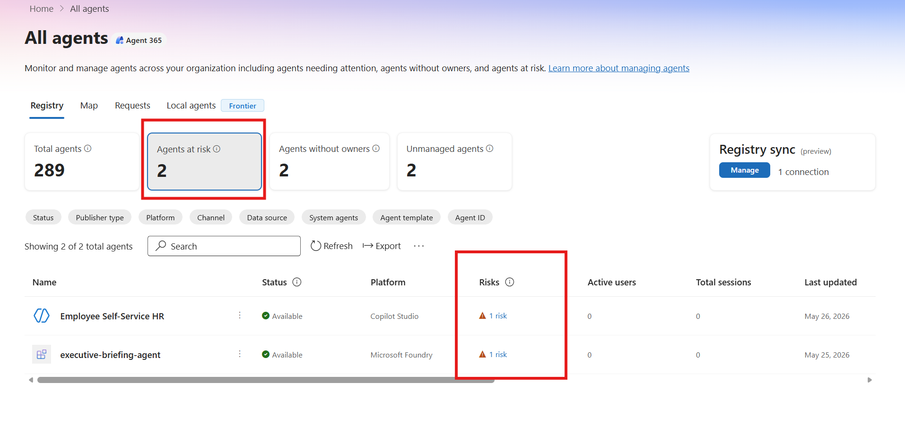
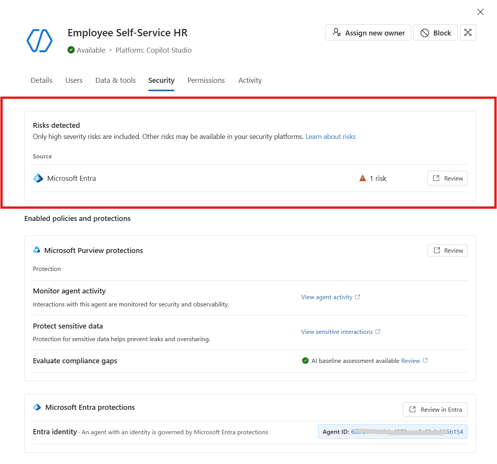
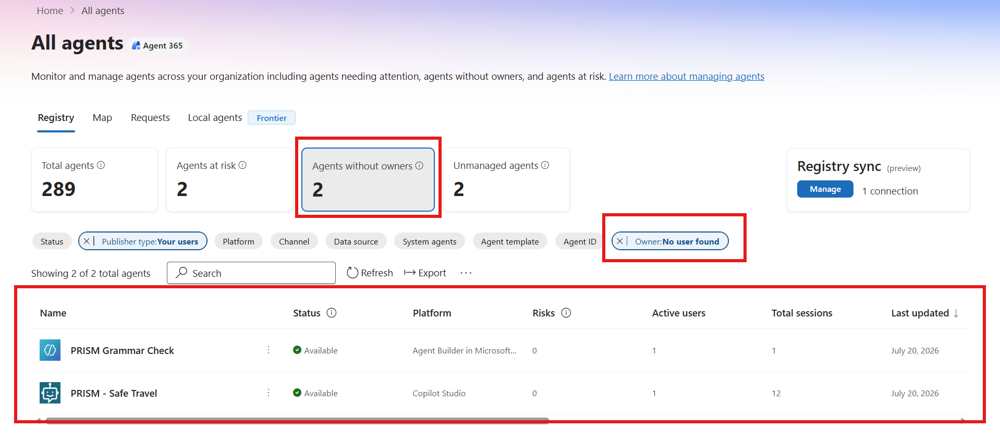
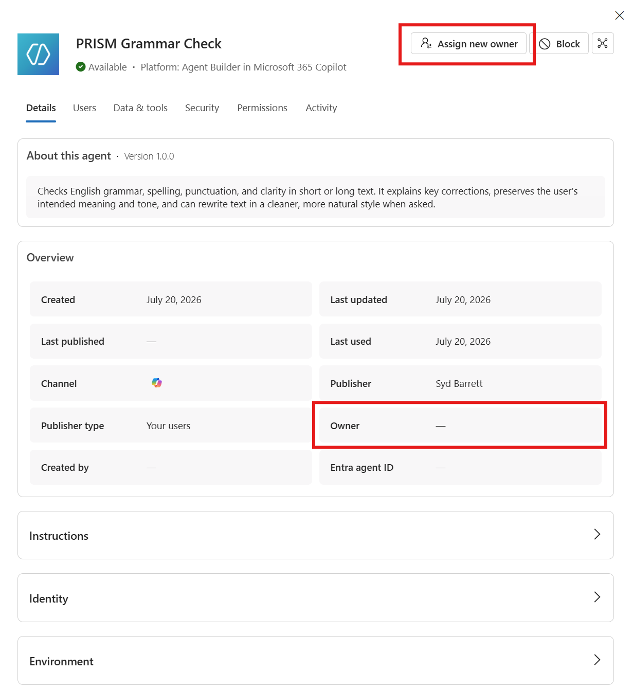
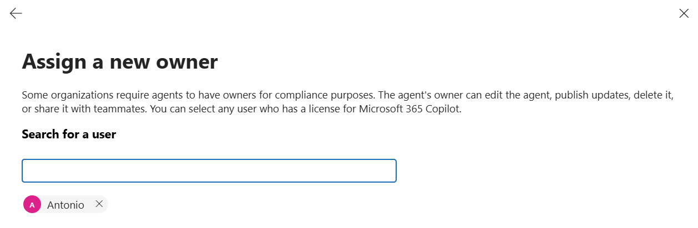
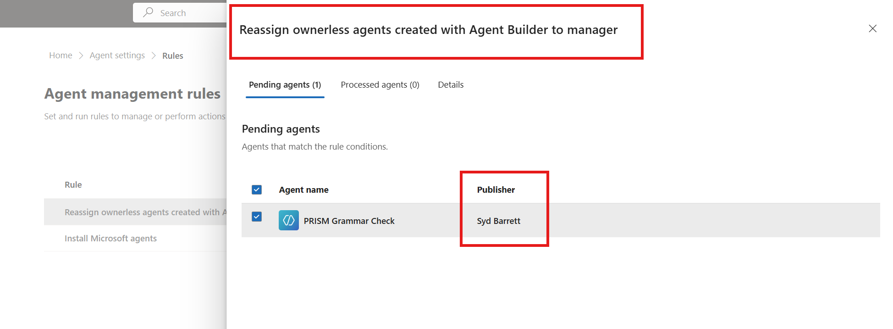

# Day 2 — Agents at risk, ownerless agents, and the rule that stops the drift

**Observe** · Published 22 Jul · [Read the LinkedIn post](https://www.linkedin.com/feed/update/urn:li:ugcPost:7485620881965277184/)

> Part of [11 Days of Agent 365](../../README.md). Personal project, tested on my own
> tenant — not official Microsoft content. Preview features may change.

## The problem
An employee leaves. The agents they built keep running — still touching data, still
holding permissions, still acting on behalf of a person who no longer works here — with
nobody accountable for them. And the signals that would tell you this is happening are
scattered: some risk lives in Entra, some in Purview, some in Defender. Three portals,
three consoles, no single place that says "these agents are the ones to worry about."

## What Agent 365 does about it
The **Agents at risk** card aggregates high-severity risk from **Entra**, **Purview**
and **Defender** onto one tenant-level view, so prioritisation happens in a single place
instead of three.

*The tenant-level risk card — high-severity risk from Entra, Purview and Defender in one place.*

Risk is broken out by **named risk types** and severity — **shadow agent**, **no owner
assigned**, **excessive permissions**, **misconfiguration** — so you can see not just
that an agent is risky, but *why*.

*Risk detail — named risk types and severities, not a single opaque score.*

The **Agents without owners** view surfaces orphaned agents directly, turning the "no
owner assigned" signal into a working list you can act on.

*The ownerless view — orphaned agents surfaced as a working list.*

Open any at-risk agent and its **Security** tab shows the risk source, the **Purview &
Entra** protections in force, and the agent's own **governed Entra identity** — the full
context in one pane.

*The orphaned agent (Owner: —) — risk source, protections in force, and its Entra identity.*

**The fix that scales.** Reassign an owner through the **people picker**; the change
lands in the **audit log** automatically, so there's an evidence trail without extra
work.

*The people picker — search and select the accountable owner.*

*The reassignment in motion — from ownerless to owned, with the change recorded in the audit log.*

Then, so the *next* orphan doesn't need a human at all, create an **agent management
rule** to auto-remediate future ownerless agents.

*The rule that auto-remediates — the next orphan is handled without manual work.*

## Try it yourself
1. Open the **Microsoft 365 admin center** and go to **Agents › Overview**; read the
   **Agents at risk** card.
2. Open an **at-risk agent › Security** tab and review the **risk source**, the
   **Purview & Entra protections**, and the agent's **Entra identity**.
3. Filter the registry to **Agents without owners**.
4. Open an ownerless agent and choose **Assign new owner › people picker › confirm**.
5. Check the **audit entry** for the reassignment.
6. Create an **agent management rule** to auto-reassign future orphans.

## Watch-outs
- The card is a **prioritisation surface, not a SOC console** — deep investigation still
  happens in **Entra**, **Purview** or **Defender**.
- The agent must **genuinely be ownerless** before you can demo reassignment.
- **"Excessive permissions"** is a least-privilege violation measured against the
  agent's *declared function* — it does **not** detect intent.
- Allow signals **~24h to mature**, or the card looks empty.

## What's in this folder
- `assets/01-agents-at-risk-card.png` — the tenant-level risk card.
- `assets/02-risk-types-severity.png` — risk detail (named risk types and severities).
- `assets/03-agents-without-owners.png` — the ownerless view.
- `assets/04-reassign-owner-details.png` — the orphaned agent (Owner: —).
- `assets/05-reassign-owner-picker.png` — the people picker.
- `assets/reassign-owner.gif` — the reassignment in motion.
- `assets/06-management-rule.png` — the rule that auto-remediates.
- `technical/` — scripts, KQL, configs supporting this scenario.

## References
- [Agents at risk — risk types, severities, and signal sources](https://learn.microsoft.com/en-us/microsoft-agent-365/)
- [Assign a new owner to an agent](https://learn.microsoft.com/en-us/microsoft-agent-365/)
- [Shadow AI in the Microsoft 365 admin center](https://learn.microsoft.com/en-us/microsoft-agent-365/)
