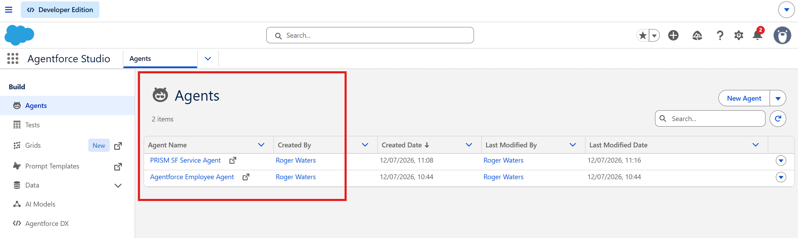
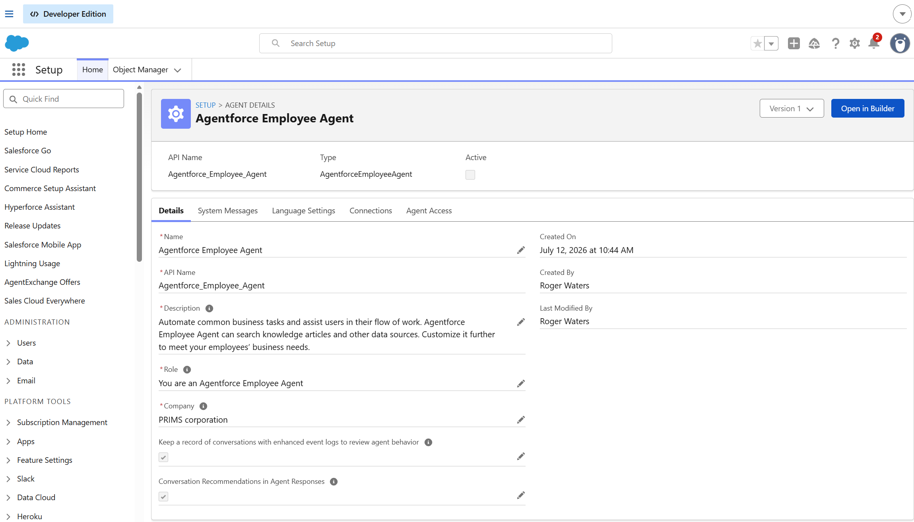
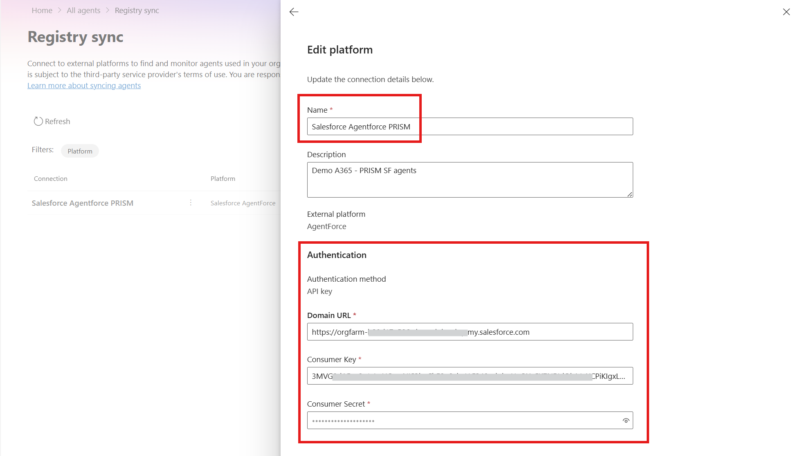
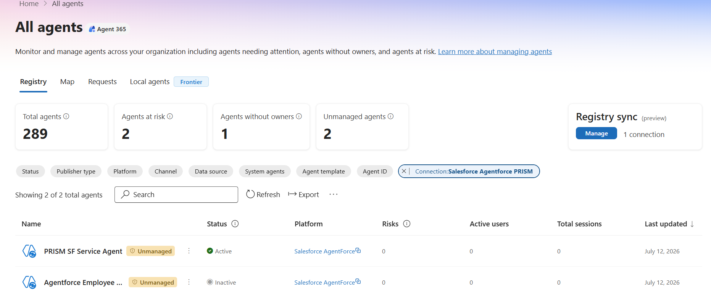

# Day 3 — Salesforce Agentforce, and the AI nobody approved

**Observe** · Published 23 Jul · [Read the LinkedIn post](https://www.linkedin.com/posts/antonioformato_11daysofagent365-agent365-aisecurity-ugcPost-7485975126199619584-jfvB/)

> Part of [11 Days of Agent 365](../../README.md). Personal project, tested on my own
> tenant — not official Microsoft content. Preview features may change.

## The problem
The agents that never get governed are the ones built somewhere else. An agent stood up
on **Salesforce Agentforce**, **Amazon Bedrock**, **Google Vertex AI**, **Databricks** or
**Anthropic Claude** gets waved through as "someone else's platform, not ours" — so it
never enters any inventory you actually govern. It still reads your data and acts on your
business, but it lives outside the registry, outside the risk view, outside the audit
trail. Nobody approved it, and nobody can see it.

*The agents as built in Agentforce Studio — real, in use, and invisible to your governance.*

*One Agentforce agent's configuration — the kind of external build that never reaches your inventory.*

## What Agent 365 does about it
**Registry sync** connects those external platforms and synchronizes their agents into the
same **Agent 365 registry** — one metadata model, no SDK. On the Salesforce side it's an
**OAuth connected app**: you supply the **domain URL**, **consumer key** and **consumer
secret**. Once the connection validates, Agent 365 pulls the Agentforce agents in.

*The registry-sync connection (auth details redacted) — domain URL, consumer key and consumer secret.*

*Registry sync in motion — connecting Agentforce and pulling its agents into the registry.*

Once synced, the Agentforce agents appear in the registry **next to native Microsoft
agents**, filterable by connection and platform — the multi-cloud fleet in one place.

*The payoff — Agentforce agents inside Agent 365, alongside native agents and filterable by platform.*

## Try it yourself
1. **On Salesforce**, create the **OAuth connected app** and collect its **domain URL**,
   **consumer key** and **consumer secret**.
2. In the **Microsoft 365 admin center**, go to **Agents › All agents › Registry sync ›
   Connect a platform**.
3. **Pick the platform** — Bedrock, Vertex AI, Agentforce, Databricks, or Anthropic Claude.
4. **Enter the credentials** (for Agentforce: domain URL, consumer key, consumer secret)
   and **validate** the connection.
5. Press **Sync**.
6. **Filter the registry by the connection** to see the synced agents alongside your
   native ones.

## Watch-outs
- **Registry sync is PREVIEW** — expect it to change.
- The management actions available on a synced agent are **only the ones the source
  platform's API exposes**. Synced agents show as **"unmanaged"** until you assign an
  **Entra Agent ID** — so this gives you inventory and observability, **not full control**.
- **Sync is manual today** — you press **Sync**. Scheduled synchronization is still on the
  roadmap, so the multi-cloud inventory is only as current as the **last sync**.
- **Migration note:** third-party cloud agents are **no longer discoverable** through the
  old Defender for Cloud connectors — **registry sync is the path now**.

## What's in this folder
- `assets/01-registry-sync-connection.png` — the registry-sync connection (auth details redacted).
- `assets/02-agentforce-studio-agents.png` — the agents as built in Agentforce Studio.
- `assets/03-agentforce-agent-detail.png` — one Agentforce agent's configuration.
- `assets/04-agentforce-agents-in-a365.png` — the payoff: Agentforce agents inside Agent 365.
- `assets/salesforce-registry-sync.gif` — registry sync in motion, bringing Agentforce agents in.
- `technical/` — scripts, KQL, configs supporting this scenario.

## References
- [Registry sync in the Microsoft 365 agent registry (preview)](https://learn.microsoft.com/en-us/microsoft-agent-365/)
- [Connect existing agents to Microsoft Agent 365](https://learn.microsoft.com/en-us/microsoft-agent-365/)
