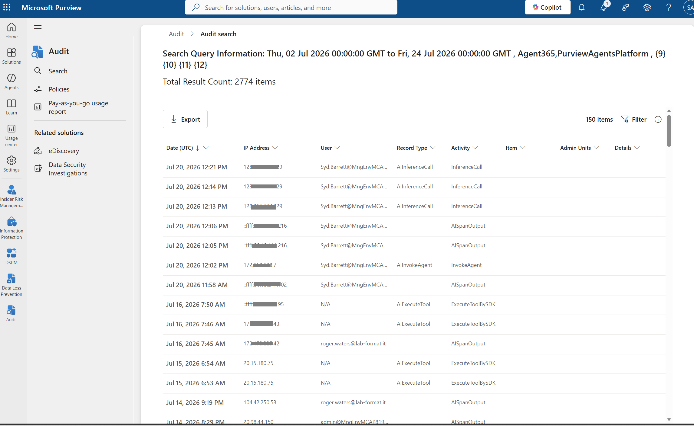
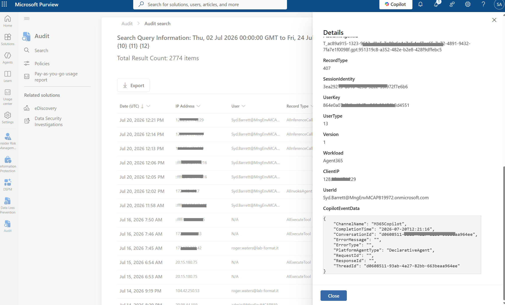
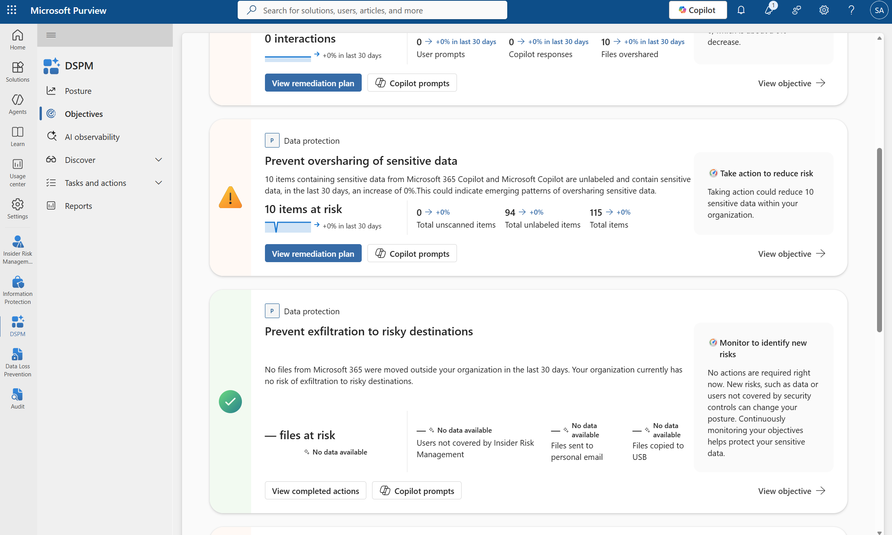
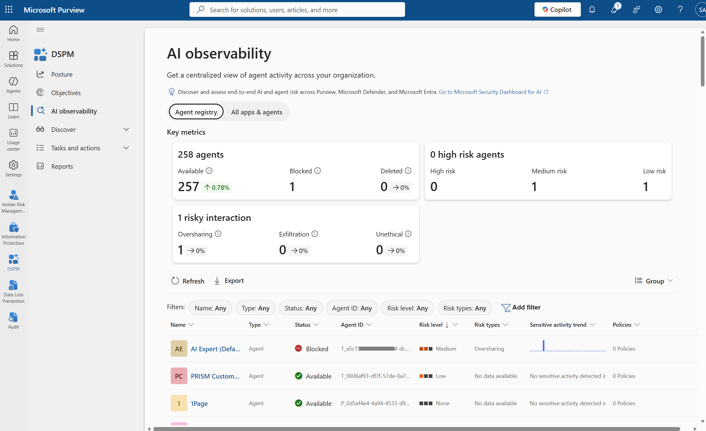
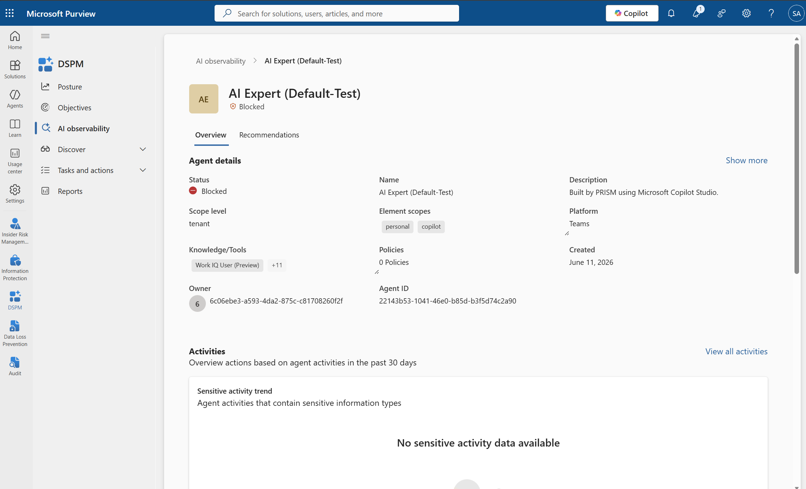
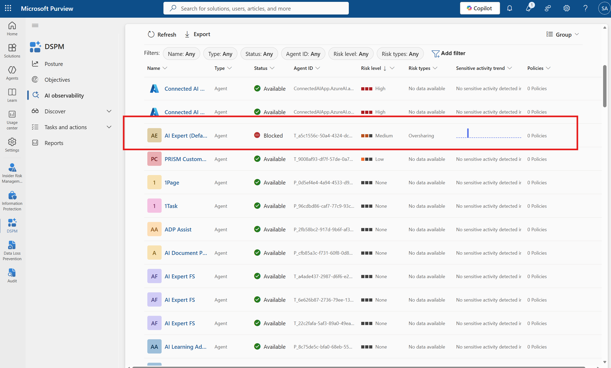
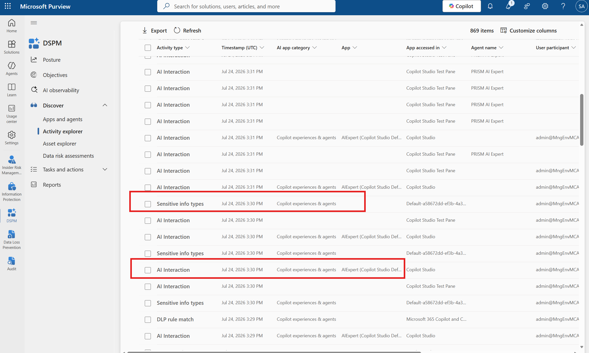
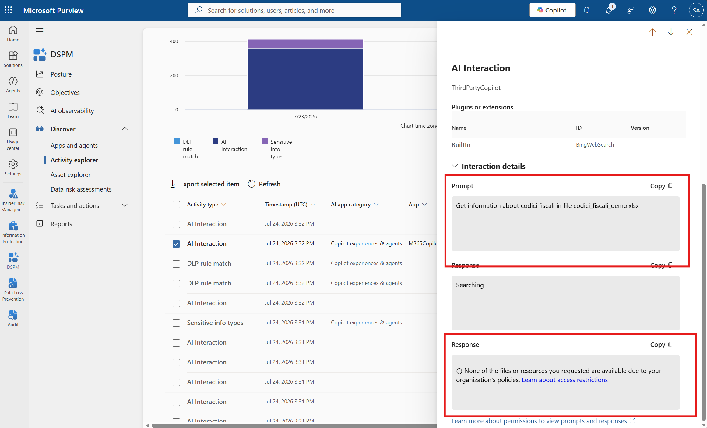

# Day 5 — Purview: audit and DSPM, the evidence a regulator asks for

**Govern** · Published 25 Jul · [Read the LinkedIn post](POST_URL_PLACEHOLDER)

> Part of [11 Days of Agent 365](../../README.md). Personal project, tested on my own
> tenant — not official Microsoft content. Preview features may change.

## The problem
Agents read documents, summarize mail and move information faster than any human. The
audit question always arrives later — *which agent read that file, when, and on whose
behalf?* — and by then the signals are scattered across activity logs, classification
data and posture dashboards. Reconstructing a single agent's actions after the fact means
stitching those fragments back together under time pressure, which is exactly when you
don't want to be guessing.

## What Agent 365 does about it
It's the same reality seen at five levels of zoom — from a single logged event out to
whole-estate posture — and each level is a real surface in Microsoft Purview.

**1. Did it happen?** Purview › Audit captures agent activity automatically — inference
calls, agent invocations and tool executions — building up thousands of records over a
few weeks with no extra configuration.

*Purview › Audit: 2,774 agent activity records captured over a multi-week window.*

**2. Who, when, and on whose behalf?** Each record's Details pane reconstructs the chain:
`Workload = Agent365`, the `RecordType`, `SessionIdentity`, `ConversationId`/`ThreadId`,
`PlatformAgentType`, and the `UserId` the agent acted for.

*One record's Details pane — Workload, RecordType, SessionIdentity, ConversationId and the UserId the agent acted for.*

**3. What was asked, and what was answered?** DSPM › Discover › Activity explorer puts AI
Interaction, Sensitive info types and DLP rule match on one timeline; opening a single
interaction reveals the captured prompt and the response.

*Prompt to block: the interaction, its sensitive-info match and the blocked response, end to end.*

*DSPM › Activity explorer: AI Interaction, sensitive info types and DLP rule match on one timeline.*

*One interaction — the captured prompt and the blocked response.*

**4. Is it a pattern?** DSPM › AI observability rolls the estate up into agent counts, risk
levels and risky interactions (oversharing, exfiltration, unethical), drillable down to a
single agent.

*DSPM › AI observability: key metrics across the estate.*

*AI observability: the agent list with per-agent risk levels.*

*One agent's observability detail — risky interactions drilled to a single agent.*

**5. How am I doing overall?** DSPM › Objectives turns all of it into items at risk,
unlabeled items and a concrete remediation plan.

*DSPM › Objectives: items at risk, unlabeled items and a remediation plan.*

**What's automatic** from the moment the agent instance exists: audit, sensitive-data
classification and the Compliance Manager AI assessments. **What's not automatic:** DLP,
Insider Risk, eDiscovery and retention — you scope the agent into those policies exactly
as you would a user. Same framework, nothing new to learn.

## Try it yourself
1. **Purview › Audit › Search** — filter to the `Agent365` / `PurviewAgentsPlatform`
   workloads over a multi-week window; read the result count and the **Activity** column.
2. **Expand one record** — read the Details pane fields: `Workload`, `RecordType`,
   `SessionIdentity`, `ConversationId`/`ThreadId`, `PlatformAgentType` and the acting
   `UserId`.
3. **DSPM › Discover › Activity explorer** — open one **AI Interaction** and read the
   captured **Prompt** and **Response**.
4. **DSPM › AI observability** — read the key metrics, then drill into one agent.
5. **DSPM › Objectives** — read items at risk and the remediation plan.

## Watch-outs
- **"Automatically enabled" is narrower than it sounds.** It covers audit, classification
  and the Compliance Manager assessments only. DLP, Insider Risk, eDiscovery and retention
  need the agent explicitly added to the policy — don't oversell the default.
- **Know which page you're on.** DSPM AI observability is the surface for active agent
  instances; DSPM for AI (classic) is a different page — be clear which one you're looking
  at.
- **Agent-to-agent interaction is a documented capability** but may not appear in your own
  audit records — describe it as a capability, separate from what your log actually shows.
- **Indexing takes time.** Audit and classification need time to populate; a fresh tenant
  looks emptier than a mature one.
- **PREVIEW surfaces here may change.**

## What's in this folder
- `assets/01-audit-search-2774-records.png` — Purview Audit search returning 2,774 agent activity records.
- `assets/02-audit-record-detail.png` — one audit record's Details pane (Workload, RecordType, SessionIdentity, acting UserId).
- `assets/03-activity-explorer.png` — DSPM Activity explorer: AI Interaction, sensitive info types and DLP rule match on one timeline.
- `assets/04-prompt-response-blocked.png` — one interaction: the captured prompt and the blocked response.
- `assets/05-ai-observability-key-metrics.png` — DSPM AI observability key metrics across the estate.
- `assets/06-ai-observability-agent-list.png` — AI observability agent list with per-agent risk levels.
- `assets/07-agent-observability-detail.png` — one agent's observability detail with its risky interactions.
- `assets/08-dspm-objectives-posture.png` — DSPM Objectives posture: items at risk, unlabeled items and remediation plan.
- `assets/purview-prompt-block.gif` — the prompt-to-block chain: interaction, sensitive-info match and blocked response, end to end.
- `technical/` — scripts, KQL, configs

## References
- [Use Microsoft Purview to manage data security & compliance for Microsoft Agent 365](https://learn.microsoft.com/purview/ai-agent-365)
- [Audit log activities](https://learn.microsoft.com/purview/audit-log-activities)
- [Data Security Posture Management (DSPM) for AI](https://learn.microsoft.com/purview/dspm-for-ai)
