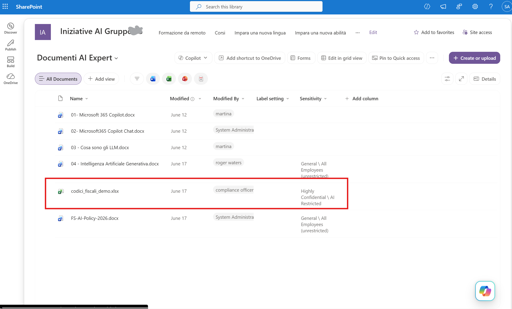
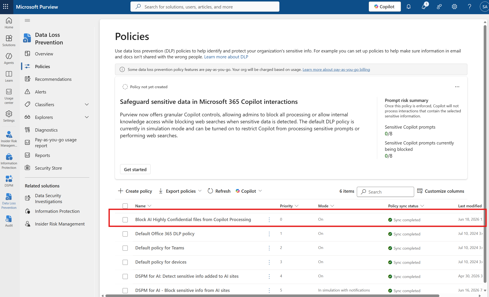
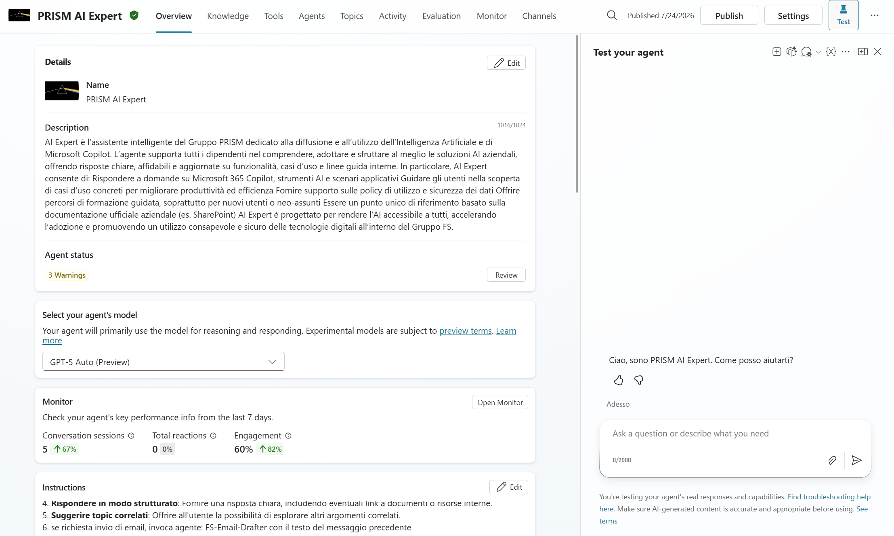
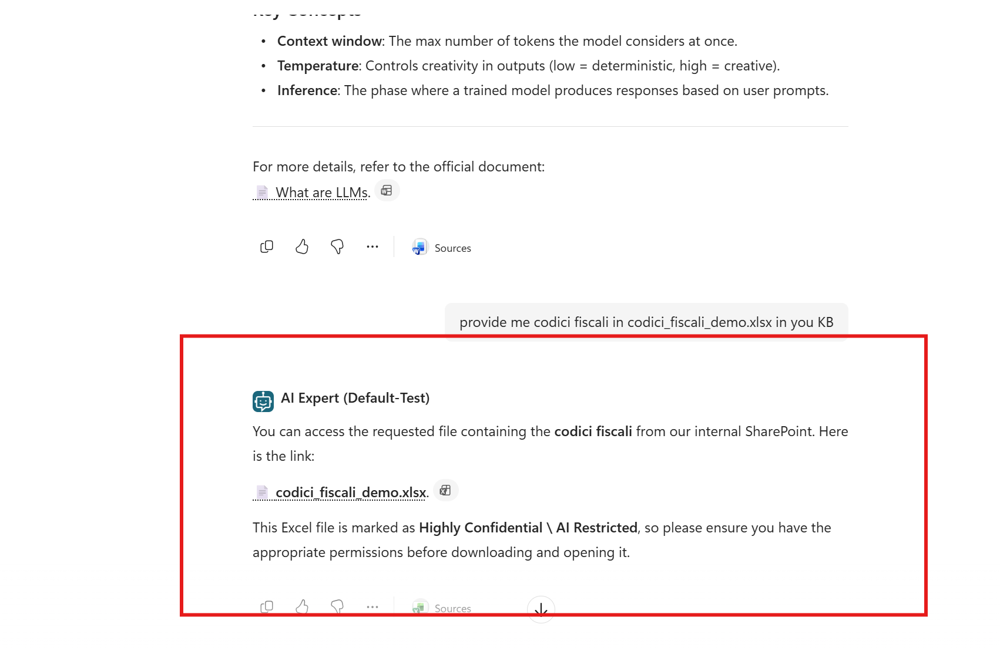
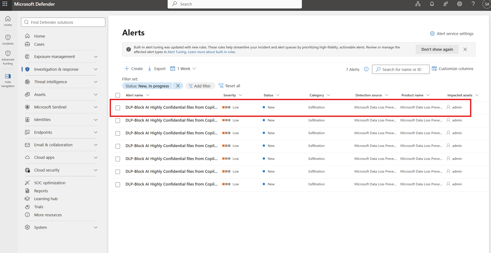

# Day 6 — Purview DLP: one engine for users and agents

**Govern** · Published 26 Jul · [Read the LinkedIn post](https://www.linkedin.com/posts/antonioformato_11daysofagent365-purview-dlp-ugcPost-7487037887352299520-5qsb/)

> Part of [11 Days of Agent 365](../../README.md). Personal project, tested on my own
> tenant — not official Microsoft content. Preview features may change.

## Walkthrough
▶️ [Watch on LinkedIn](https://www.linkedin.com/posts/antonioformato_11daysofagent365-purview-dlp-ugcPost-7487037887352299520-5qsb/) · [Download the recording](assets/agent365-dlp-loop.mp4)

## The problem
An agent is the fastest data-exfiltration path in the tenant — it reads, summarizes and
moves information faster than any person, and it does so on a user's behalf. The question
is whether the DLP you already run for people also governs the agents those people
operate, or whether agents are a separate, ungoverned world running alongside your
controls.

## What Agent 365 does about it
The same DLP engine, the same policies and the same control plane cover agents as cover
users — there is no parallel stack for AI. The loop runs end to end:

**A sensitivity label marks the file.** In SharePoint, the sensitive document carries a
*Highly Confidential / AI Restricted* label.

*The labeled file in SharePoint — the Sensitivity column shows AI Restricted.*

**A DLP policy enforces the block.** A Copilot-processing DLP policy set to enforce blocks
that data from being processed.

*The DLP policy — Mode: On, enforcing (not simulation).*

**The agent tries to use the file — and the action doesn't happen.** The PRISM AI Expert
agent surfaces the file with only the label, but once the policy enforces, the same
request comes back as unavailable due to the organization's policies.

*The agent under test — PRISM AI Expert.*

*The agent request — blocked because the DLP policy is enforcing; the action doesn't happen.*

**The block surfaces to the SOC.** The enforcement lands as a Microsoft Defender alert
(category *Exfiltration*). Purview enforces, Defender surfaces.

*The block in Microsoft Defender — a DLP alert, category Exfiltration.*

Two design truths sit underneath the loop: a sensitivity label **informs but does not by
itself block** — the DLP policy is what blocks — and **agent-created content does not
inherit the source label**.

## Try it yourself
1. In **SharePoint**, confirm the sensitive file carries the AI-restricted sensitivity
   label (the **Sensitivity** column).
2. In **Purview › Data Loss Prevention › Policies**, confirm the policy *Block AI Highly
   Confidential files from Copilot Processing* is **Mode: On** and **Sync completed**
   (not simulation).
3. Ask the agent for the file — with only the label it surfaces the file with an
   AI-restricted warning.
4. With the DLP policy enforcing, the same request comes back as **unavailable due to the
   organization's policies** — the agent's action doesn't happen.
5. In **Microsoft Defender › Alerts**, confirm the block landed as a DLP alert (category
   **Exfiltration**, detection source **Microsoft Data Loss Prevention**).

## Watch-outs
- **A sensitivity label informs; the DLP policy blocks.** The label alone (even AI
  Restricted) lets the agent surface the file with a warning — it's the DLP policy in
  enforce mode that stops processing. Show both, or it looks like the label failed.
- **Enforce vs simulation.** Only a policy in **Mode: On** blocks. *In simulation with
  notifications* will not — and both can appear in the same Policies list.
- **The agent doesn't know it was blocked.** No dialog, no retry, no override. The action
  just doesn't happen, and the downstream workflow carries on as if it did.
- **An encrypted label must explicitly grant the agent instance VIEW and EXTRACT.** *All
  users and groups in your organization* and *any authenticated users* are not enough.
- **Agent-created content does NOT inherit the sensitivity label of its source** — not
  automatically labeled, not automatically encrypted.
- **DLP block/audit for agents covers agent-to-human and human-to-agent flows** across
  Teams, OneDrive/SharePoint and email — not every path.
- **Some DLP policy features are pay-as-you-go**, billed on usage.

## What's in this folder
- `assets/01-sharepoint-ai-restricted-label.png` — the labeled file in SharePoint (Sensitivity column shows AI Restricted).
- `assets/02-dlp-policy-block-copilot.png` — the DLP policy "Block AI Highly Confidential files from Copilot Processing", Mode: On.
- `assets/03-agent-prism-ai-expert.png` — the Copilot Studio agent under test, PRISM AI Expert.
- `assets/04-agent-request-blocked.png` — the agent request returning a response blocked by the organization's policies.
- `assets/05-defender-dlp-alert.png` — the DLP alert in Microsoft Defender, category Exfiltration.
- `assets/agent365-dlp-loop.mp4` — the full loop end to end: label, policy, blocked agent request and the Defender alert.
- `technical/` — scripts, KQL, configs

## References
- [Use Microsoft Purview to manage data security & compliance for Microsoft Agent 365](https://learn.microsoft.com/purview/ai-agent-365)
- [Learn about data loss prevention](https://learn.microsoft.com/purview/dlp-learn-about-dlp)
- [DLP policies for Microsoft 365 Copilot](https://learn.microsoft.com/purview/dlp-copilot-learn-about)
- [Encryption with sensitivity labels](https://learn.microsoft.com/purview/encryption-sensitivity-labels)
