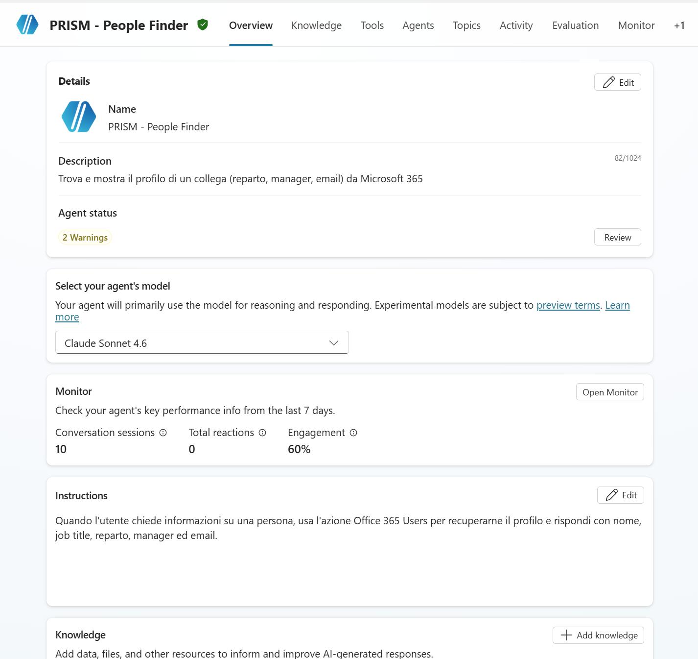
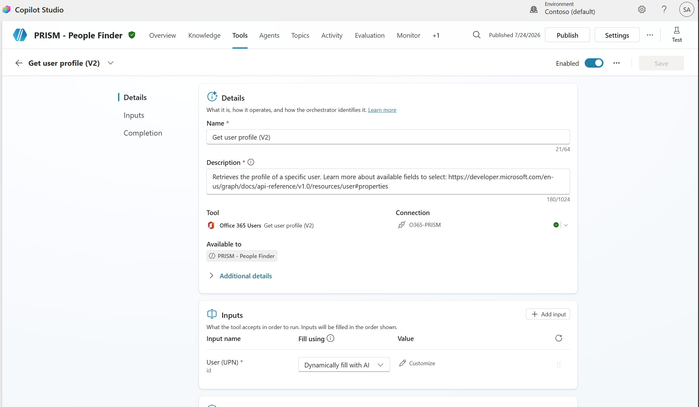
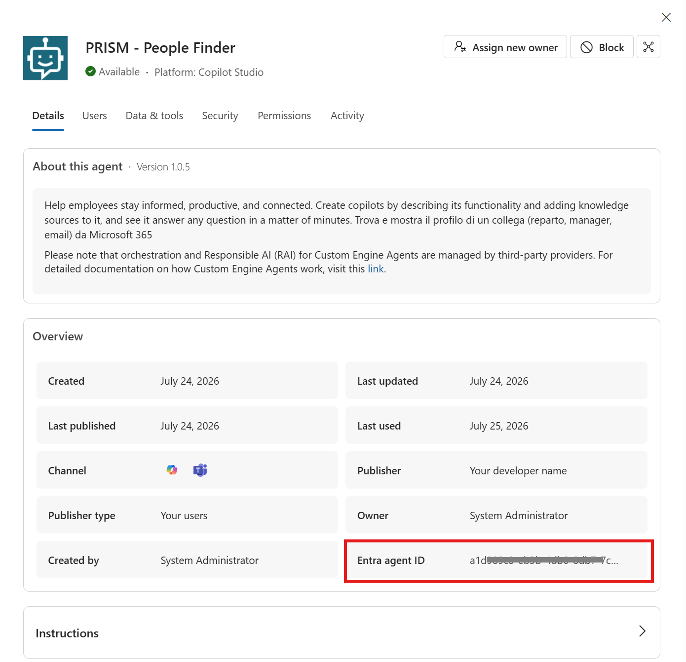
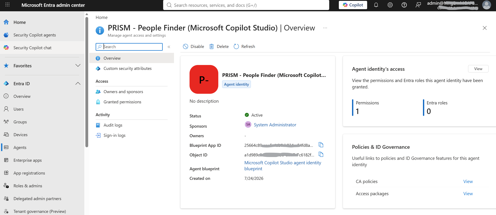
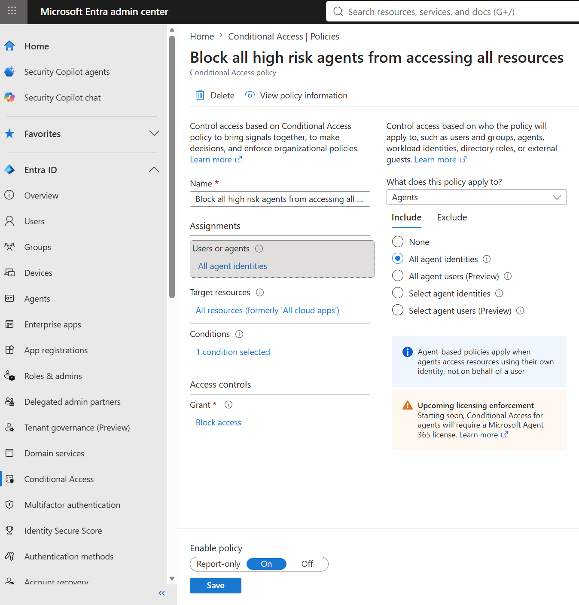
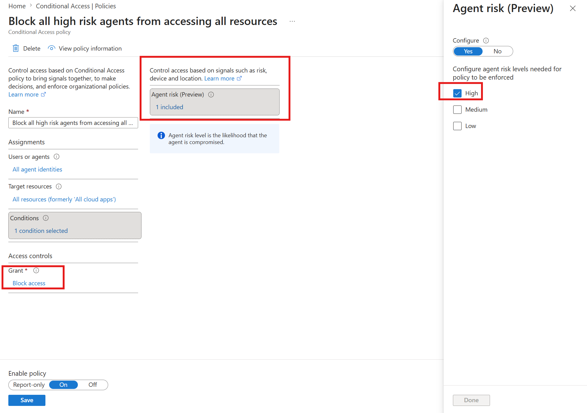
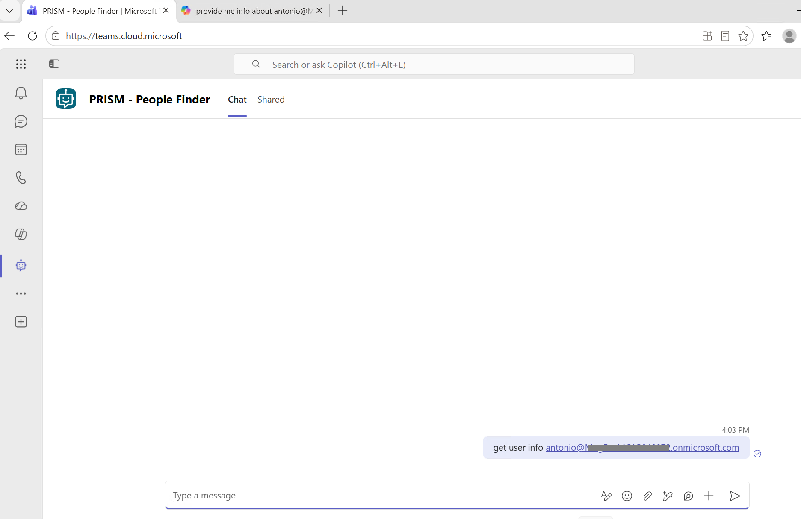
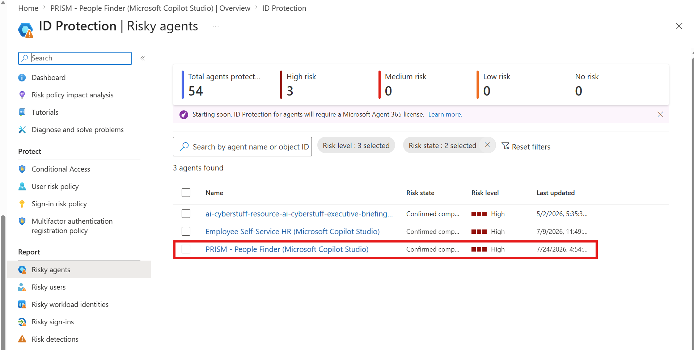
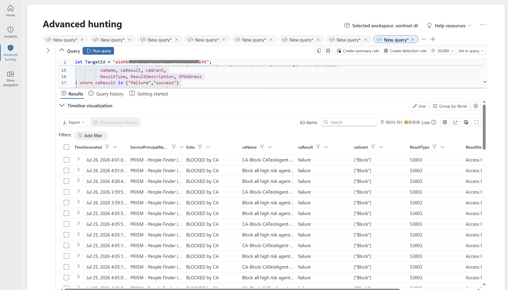

# Day 7 — Entra Agent ID, Conditional Access, and a compromised agent

**Secure** · Published 27 Jul · [Read the LinkedIn post](POST_URL_PLACEHOLDER)

> Part of [11 Days of Agent 365](../../README.md). Personal project, tested on my own
> tenant — not official Microsoft content. Preview features may change.

## Walkthrough
▶️ [Watch on LinkedIn](POST_URL_PLACEHOLDER) · [Download the recording](assets/agent365-ca-block-demo.mp4)

## The problem
You can't apply Zero Trust to a nameless process. Once agents start acting inside your
tenant, the question is whether they're governable principals inside your perimeter — with
an identity, permissions and a lifecycle you can reason about — or unmanaged processes
running outside it, invisible to the controls you already trust for people.

## What Agent 365 does about it
Every agent gets an **Entra Agent ID** — a first-class identity with its own permissions,
sponsor and lifecycle. That identity is the foundation every other Zero Trust control
attaches to.

The agent under test is **PRISM - People Finder**, built in Copilot Studio with an Office
365 connector.

*The agent under test — PRISM - People Finder in Copilot Studio.*

*Its tool — the Get user profile (V2) action on the Office 365 Users connector.*

Because the agent is a real principal, it carries an Entra Agent ID you can find in the
agent's details and manage in Entra like any other identity.

*The agent's Entra Agent ID, surfaced in the agent detail.*

*The same identity in Entra — Active, with its blueprint, sponsor and permissions.*

Conditional Access treats agents as **their own assignment type** — *All agent identities* —
with **Agent risk** as a condition and **Block** as the control. It's a distinct surface,
not borrowed from user policies.

*The Conditional Access policy — assignment All agent identities, grant Block access.*

*The condition — Agent risk = High.*

End to end, the loop runs like this. First the agent works normally.

*Baseline — the agent working in Teams before any risk is raised.*

Its risk is then raised to **High** via the Microsoft Graph `riskyAgents` API, so it shows
as **Confirmed compromised** in ID Protection.

*ID Protection › Risky agents — the agent is now Confirmed compromised / High.*

The same request is now blocked at token request, and Advanced hunting confirms it.

*After — Advanced hunting shows the request BLOCKED by CA (ResultType 53003).*

## Try it yourself
1. Build and publish a **Copilot Studio** agent and note its **Entra Agent ID**.
2. In **Entra › Conditional Access**, create a policy: assignment = **All agent
   identities**, condition = **Agent risk = High**, grant = **Block access**; set
   **Enable policy = On**.
3. Confirm the agent works (for example, in **Teams**).
4. Run the simulation script (see below) to raise the agent's risk to **High**.
5. Confirm it shows as **Confirmed compromised** in **ID Protection › Risky agents**.
6. Retry the same request — it's now **blocked**.
7. Verify in **Advanced hunting** with [technical/ca-block-verification.kql](technical/ca-block-verification.kql)
   (result **53003**).

## Watch-outs
- **The CA policy must be Mode: On to block.** In *Report-only* it only logs — it does not
  block. Set it On before testing, or nothing gets stopped.
- **For agent identities the only condition is Agent risk and the only control is Block.**
  There's no interactive remediation — nobody is there to complete an MFA prompt.
- **Agent risk detections are offline, not real-time.** Design your incident response
  around that timing.
- **CA enforcement fires when the agent requests a token for a resource** — not when a
  blueprint creates agent identities.
- **Licensing enforcement is "coming soon".** Conditional Access / ID Protection for
  agents will require a Microsoft Agent 365 license; report it as the portal does, not as
  already enforced.
- **The `riskyAgents` API is `/beta` and preview** — it may change.

## Simulation script
The script used to raise the agent's risk to High lives at the repo root:
[agent-risk/](../../agent-risk/). It calls the Microsoft Graph `riskyAgents` API
(`/beta`, preview). MIT.

## What's in this folder
- `assets/01-agent-copilot-studio.png` — the PRISM - People Finder agent in Copilot Studio (Office 365 connector).
- `assets/02-get-user-profile-tool.png` — the Get user profile (V2) tool / Office 365 Users action.
- `assets/03-agent-entra-id.png` — the agent detail showing its Entra Agent ID.
- `assets/04-agent-identity-in-entra.png` — the agent identity in Entra (Active, blueprint, sponsor, permissions).
- `assets/05-conditional-access-policy.png` — the Conditional Access policy (All agent identities, Block access).
- `assets/06-agent-risk-high-condition.png` — the Agent risk = High condition.
- `assets/07-agent-working-teams.png` — the agent working in Teams (baseline, before risk).
- `assets/08-risky-agent-confirmed-compromised.png` — ID Protection › Risky agents, Confirmed compromised / High.
- `assets/09-advanced-hunting-blocked-53003.png` — Advanced hunting showing BLOCKED by CA / ResultType 53003.
- `assets/agent365-ca-block-demo.mp4` — the full demo end to end.
- `technical/ca-block-verification.kql` — Advanced hunting query to confirm the CA block (result 53003).

## References
- [Conditional Access for agents](https://learn.microsoft.com/entra/identity/conditional-access/agent-id)
- [ID Protection for agents (risky agents)](https://learn.microsoft.com/entra/id-protection/concept-risky-agents)
- [riskyAgent: confirmCompromised (Graph beta)](https://learn.microsoft.com/graph/api/riskyagent-confirmcompromised?view=graph-rest-beta)
- [Manage agent identities](https://learn.microsoft.com/entra/agent-id/manage-agent-identities-admin)
