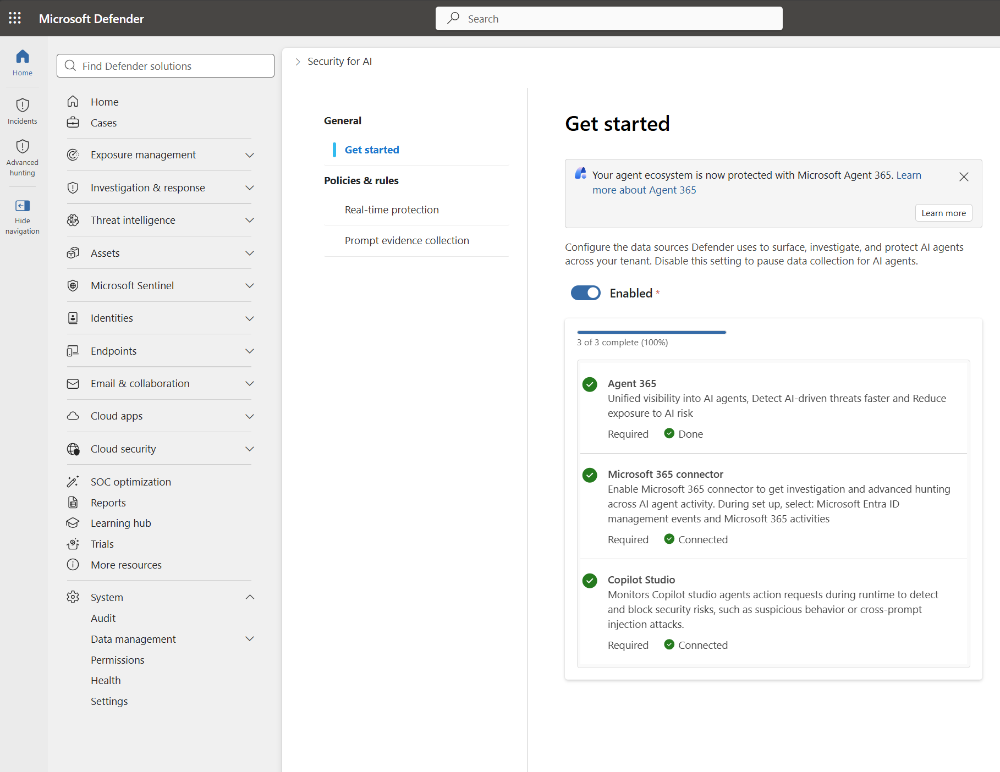
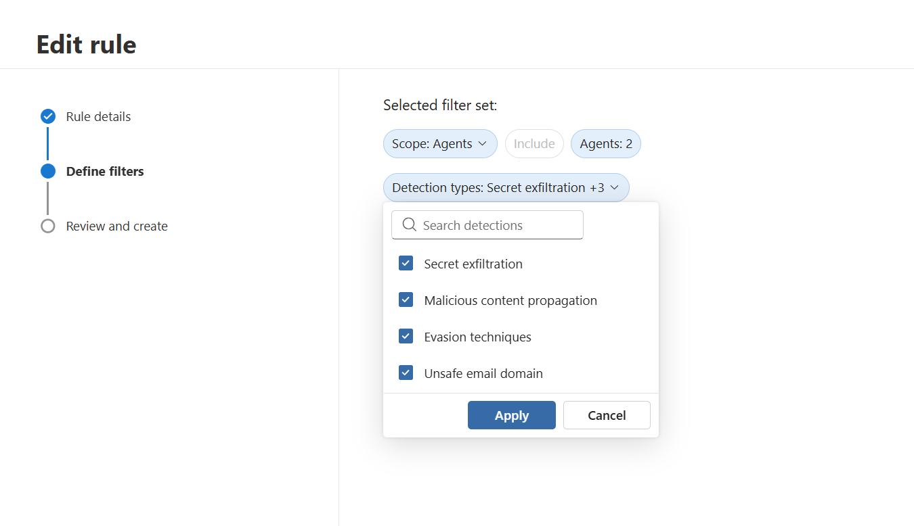
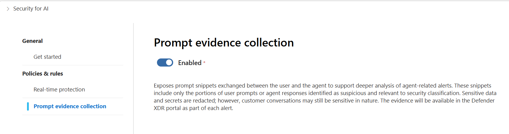
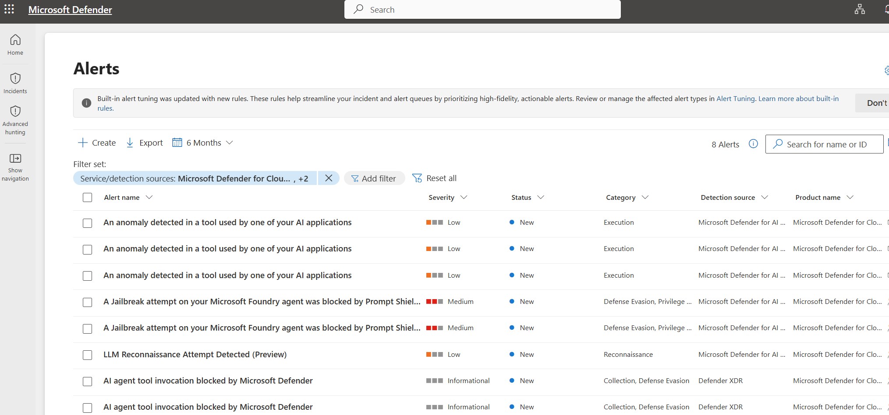
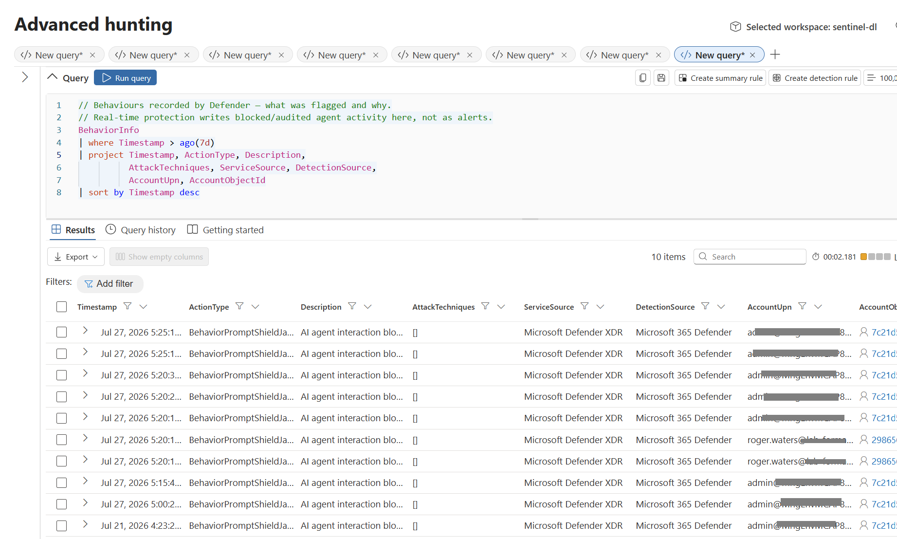
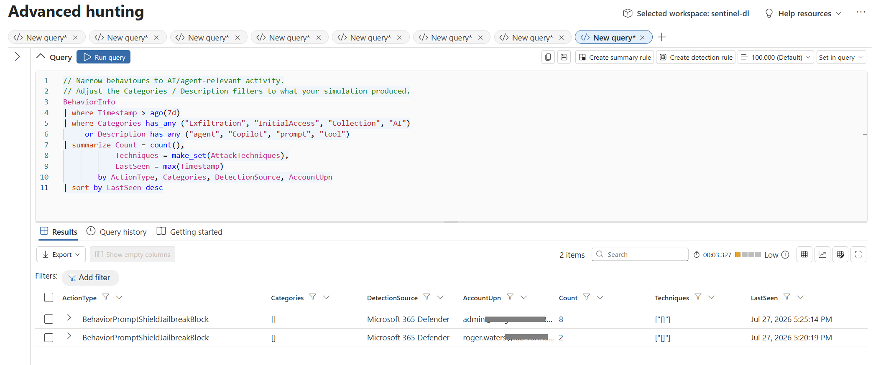
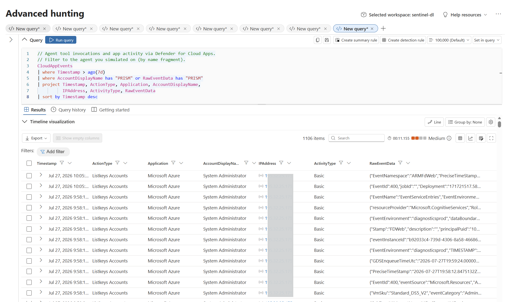
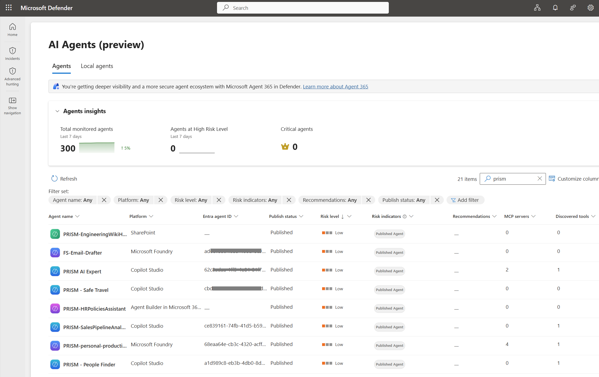

# Day 8 — Defender: block the tool call, then hunt the behavior

**Secure** · Published 28 Jul · [Read the LinkedIn post](https://www.linkedin.com/posts/antonioformato_11daysofagent365-defenderxdr-threathunting-ugcPost-7487777291880566784-NfUz/)

> Part of [11 Days of Agent 365](../../README.md). Personal project, tested on my own
> tenant — not official Microsoft content. Preview features may change.

## The problem
Prompt injection and jailbreaks are the attack surface everyone worries about, and a silent
model refusal tells the SOC nothing. When an agent quietly declines a poisoned instruction,
there's no signal, no evidence, no trail to pull on. You need blocks that both stop the
action **and** leave something to investigate.

## What Agent 365 does about it
Enable **Security for AI** (Agent 365 + Microsoft 365 + Copilot Studio connectors) and
Defender inspects agent prompts, tool calls and tool responses at runtime.

*Security for AI — all three connectors (Agent 365, Microsoft 365, Copilot Studio) connected.*

Real-time protection blocks risky actions mid-loop across detection types — secret
exfiltration, malicious content propagation, evasion techniques and unsafe email domain.

*A real-time protection rule — the detection types it can block mid-loop.*

*Prompt evidence collection — surfaces prompt snippets in alerts, with sensitive data and secrets redacted.*

Blocked activity is recorded as **behaviours** in `BehaviorInfo` **and** surfaced as
**alerts** — so the SOC can hunt it with the same KQL and portal they already use. That's
the "block, then hunt" pair: the alert fires, and the behaviour is right there to
investigate.

*Block — Defender alerts for the jailbreak block, LLM reconnaissance and blocked AI agent tool invocation.*

*Hunt — the same blocks as behaviours in `BehaviorInfo` (BehaviorPromptShieldJailbreakBlock).*

The behaviours summarize cleanly by type, so you can see the shape of what was stopped.

*`BehaviorInfo` summarized by ActionType and Categories.*

*`CloudAppEvents` — agent activity (IP column redacted).*

The **AI Agents (preview) inventory** shows the estate — monitored agents, risk levels, and
the MCP servers and tools per agent.

*AI Agents (preview) inventory — monitored agents, risk levels, MCP servers and tools per agent.*

In this run the simulation produced jailbreak / prompt-injection blocks
(BehaviorPromptShieldJailbreakBlock), LLM reconnaissance, and blocked tool invocations.

## Hunt it with these queries
The Advanced hunting queries for Day 8 live in [technical/](technical/) — run them in
**Microsoft Defender › Hunting › Advanced hunting**:

- **[technical/behaviors-blocked.kql](technical/behaviors-blocked.kql)** — lists the raw
  `BehaviorInfo` blocks/audits (what was flagged, why, and against which account). Start here.
- **[technical/behaviors-summarized.kql](technical/behaviors-summarized.kql)** — rolls the
  same behaviours up by type (e.g. `BehaviorPromptShieldJailbreakBlock`) so you can see the
  shape of what was stopped.
- **[technical/agents-inventory.kql](technical/agents-inventory.kql)** — the latest snapshot
  per agent from `AgentsInfo`, with defensive name resolution (`column_ifexists` /
  `RawAgentInfo` fallback) so it doesn't fail where the preview schema differs.

## Try it yourself
1. Enable **Security for AI** and connect the three connectors (Agent 365, Microsoft 365,
   Copilot Studio).
2. Configure a **real-time protection rule** with the detection types you want to block.
3. Run a benign **jailbreak / recon simulation** against a test agent.
4. In **Advanced hunting**, run [technical/behaviors-blocked.kql](technical/behaviors-blocked.kql)
   to see the blocks as behaviours.
5. Summarize with [technical/behaviors-summarized.kql](technical/behaviors-summarized.kql).
6. Check the **Alerts** queue for the matching alerts (jailbreak blocked, LLM recon, tool
   invocation blocked).
7. Review the **AI Agents** inventory for posture. Use
   [technical/agents-inventory.kql](technical/agents-inventory.kql) where `AgentsInfo` is
   populated.

## Watch-outs
- **Blocked/audited activity is recorded as behaviours, not only alerts** — and once a
  blocking rule covers an agent, alert volume can drop. Measuring coverage by alert count
  makes protection look like a regression when it's the opposite.
- **`AgentsInfo` is preview:** the documented schema and the schema populated in your tenant
  can differ (e.g. `AgentName` may not resolve). Use `column_ifexists` / `RawAgentInfo`
  fallback, as in the query provided.
- **`AIAgentsInfo` was retired for `AgentsInfo` on 1 July 2026** — migrate saved queries.
- **`AgentsInfo` keeps multiple snapshots per agent** — use `summarize arg_max(Timestamp, *)
  by AgentId` or you'll count the same agent multiple times.
- **`BehaviorInfo` and `AgentsInfo` are preview** and only populate if the relevant
  connectors are enabled (Security for AI, Defender for Cloud Apps M365 activities).
- **Prompt evidence collection surfaces prompt snippets in alerts.** Sensitive data and
  secrets are redacted, but conversations may still be sensitive — enable it knowingly.

## References
- [Protect AI agents in real time using Microsoft Defender](https://learn.microsoft.com/defender-xdr/security-for-ai/ai-agent-real-time-protection)
- [Discover AI agents and assess security posture](https://learn.microsoft.com/defender-xdr/security-for-ai/ai-agent-inventory)
- [AgentsInfo table (advanced hunting schema)](https://learn.microsoft.com/defender-xdr/advanced-hunting-agentsinfo-table)
- [BehaviorInfo table (advanced hunting schema)](https://learn.microsoft.com/defender-xdr/advanced-hunting-behaviorinfo-table)

## What's in this folder
- `assets/01-security-for-ai-connectors.png` — Security for AI Get started, all three connectors (Agent 365, Microsoft 365, Copilot Studio) connected.
- `assets/02-real-time-protection-detection-types.png` — a real-time protection rule and its detection types (secret exfiltration, malicious content propagation, evasion techniques, unsafe email domain).
- `assets/03-prompt-evidence-collection.png` — the prompt evidence collection setting.
- `assets/04-defender-alerts-ai.png` — Defender alerts (jailbreak blocked, LLM recon, AI agent tool invocation blocked).
- `assets/05-behaviorinfo-results.png` — Advanced hunting `BehaviorInfo` query and results (BehaviorPromptShieldJailbreakBlock).
- `assets/06-behaviorinfo-summarized.png` — Advanced hunting `BehaviorInfo` summarized by ActionType / Categories.
- `assets/07-cloudappevents-agent-activity.png` — Advanced hunting `CloudAppEvents` agent activity (IP column redacted).
- `assets/08-ai-agents-inventory.png` — AI Agents (preview) inventory (monitored agents, risk levels, MCP servers and tools).
- `technical/behaviors-blocked.kql` — `BehaviorInfo` blocks/audits — what was flagged and why.
- `technical/behaviors-summarized.kql` — AI/agent behaviours summarized by type.
- `technical/agents-inventory.kql` — agent inventory from `AgentsInfo` (latest snapshot per agent, defensive name resolution).
